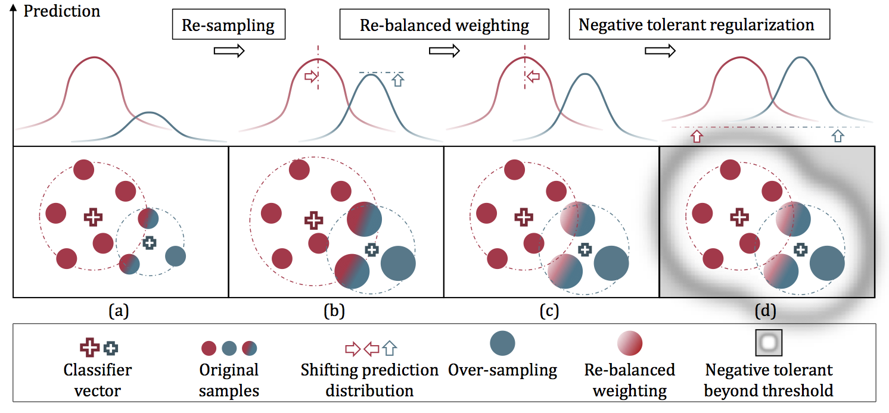

# Distribution Balance Loss

This repo is the implementation of paper *Distribution-Balanced Loss for Multi-Label Classification in Long-Tailed Datasets* (ECCV2020 **Spotlight**).



## Requirements
* Pytorch 1.1.0
* Sklearn

## TODO
- [x] Clean the Repo
- [ ] Distributed training is not supported currently
- [ ] Evaluation with single GPU is not supported currently
- [ ] uncertainty control of `create_longtail_dataset.py`
- [ ] Running in the new environment is a little bit worse than in the original one, currently trying to fix the problem

## Datasets


Our long-tail multi-label datasets are created from MS COCO 2017 and Pascal VOC 2012. Annotations and statistics data resuired when training are saved under `./appendix`
You can create a new long-tail dataset with the following command. 
```
python tools/create_longtail_dataset.py
```

## Run training
#### Installation
```
git clone git@github.com:wutong16/DistributionBalance.git
cd DistributionBalance
```
#### Train with COCO-MLT
```
python tools/train.py configs/coco/LT_resnet50_pfc_DB.py 
```
#### Train with VOC-MLT
```
python tools/train.py configs/voc/LT_resnet50_pfc_DB.py 
```

#### Try basic LVIS
Download annotation files ` lvis_v0.5_train.json` and `lvis_v0.5_val.json` from [lvisdataset.org](https://www.lvisdataset.org/dataset) and place them under `./data/LVIS`.
```
python tools/train.py configs/lvis/resnet50_pfc.py 
```
## Evaluation

#### COCO-MLT

```
bash tools/dist_test.sh configs/coco/LT_resnet50_pfc_DB.py work_dirs/LT_coco_resnet50_pfc_DB/epoch_8.pth 1
```
#### VOC-MLT

```
bash tools/dist_test.sh configs/voc/LT_resnet50_pfc_DB.py work_dirs/LT_voc_resnet50_pfc_DB/epoch_8.pth 1
```

## License and Citation
The use of this software is RESTRICTED to **non-commercial research and educational purposes**.
```
@inproceedings{DistributionBalancedLoss,
  title={Distribution-Balanced Loss for Multi-Label Classification in Long-Tailed Datasets},
  author={Wu, Tong and Huang, Qingqiu and Liu, Ziwei and Wang, Yu and Lin, Dahua},
  booktitle={European Conference on Computer Vision (ECCV)},
  year={2020}
}
```

## Contact

This repo is currently maintained by Tong Wu ([@wutong16](https://github.com/wutong16)) and Qingqiu Huang ([@HQQ](https://github.com/hqqasw))
